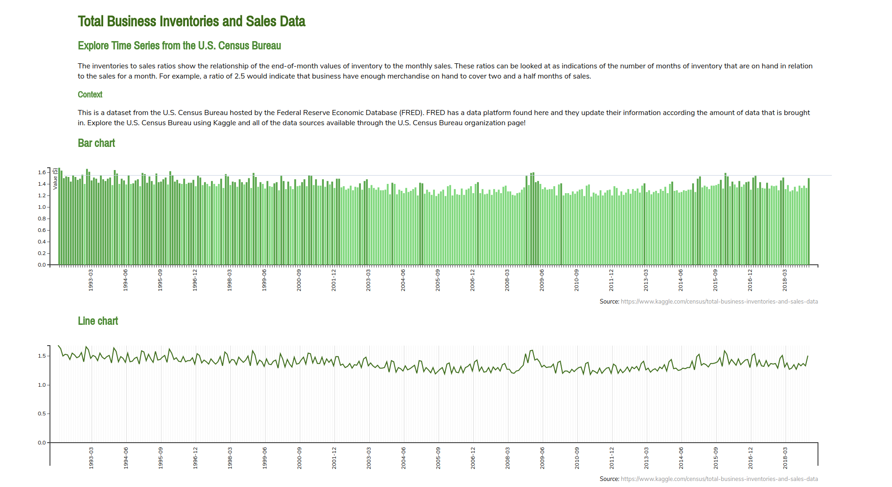

# Total Business Inventories and Sales Data

Data visualization (time serie) with bar chart animation in D3.js v3.

Using:
* D3.js (v3)
* Bar chart animation
* ECMAScript 6
* Total Business Inventories and Sales Data ([from Kaggle](https://www.kaggle.com/census/total-business-inventories-and-sales-data))
* Code available in [bl.ocks](http://bl.ocks.org/marialuisacp/c8f50cd27d34f6a34c05ab59eb3ec7e5)
* Visualization available in [github.io](https://marialuisacp.github.io/time-serie-Total-Business-Inventories-and-Sales-Data/)

